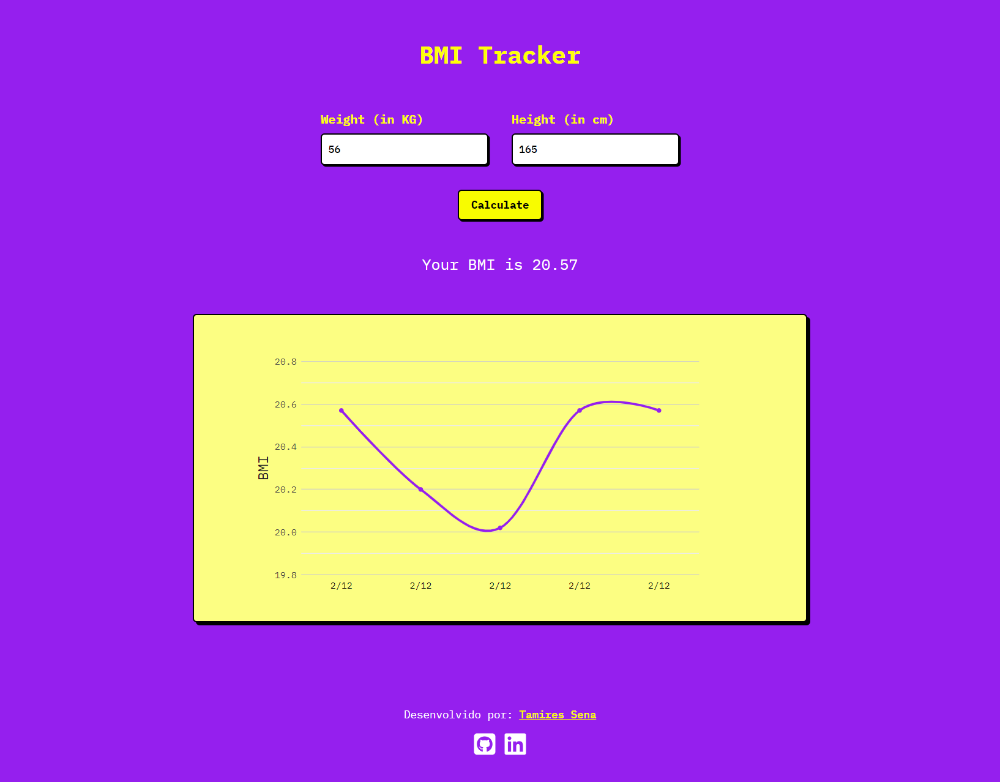

<h1>BMI Tracker</h1>

<h2 align="left">Objetivo</h2>

 
Calcule o valor do seu IMC, a partir da sua altura e peso. Será possível acompanhar a evolução do IMC ao longo do tempo, por meio do gráfico (IMC x Data).

<h2 align="left">Descrição</h2>

 
Projeto desenvolvido de forma autônoma, com o objetivo de consolidar os conhecimentos obtidos nos estudos sobre React e aprender sobre a utilização da biblioteca React Google Charts. O projeto é uma página web para cálculo do IMC e acompanhamento das informações por meio de um gráfico.

<strong>Conceitos utilizados:</strong>

<ul>
  <li>Componentização;</li>
  <li>Gestão de estados;</li>
  <li>React Hooks;</li>
  <li>Manipulação de arrays;</li>
  <li>Estilização condicional;</li>
  <li>Utilização da biblioteca React Google Charts;</li>
  <li>Responsividade desktop/mobile.</li>
</ul>

<h2 align="left">Ferramentas</h2>

Linguagens/ferramentas utilizadas:

